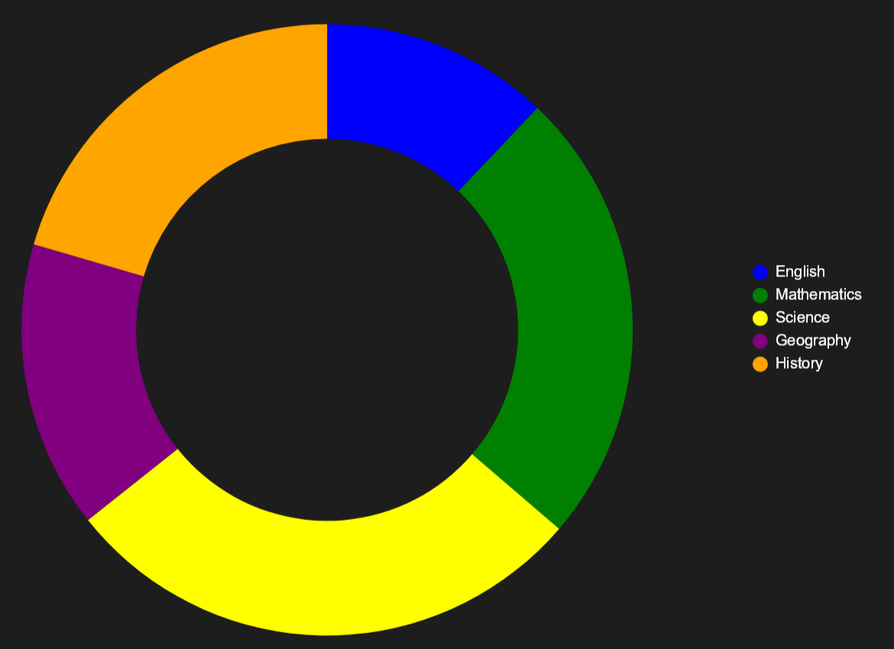
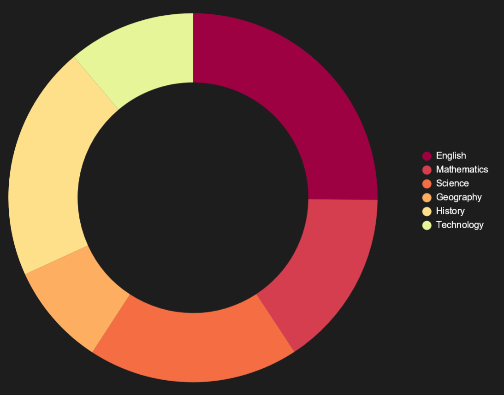

# [⮪](README.md) Setting Entry Colors
Once you've [setup](../../README.md#-setting-up) your [`DonutChartView`](../Reference/DonutChartView.md) there's a property called [`EntryColors`](../Reference/DonutChartView.md) that you can populate to render colors for each entry. 

Out of the box, the [`DonutChartView`](../Reference/DonutChartView.md) has default colors which will render something like the following:


<br/>

Let's make this chart look better by adding in some custom colors:

## XAML

```xaml
<ContentPage.Resources>
    <x:Array x:Key="ChartColors" Type="{x:Type Color}">
        <Color>#9e0142</Color>
        <Color>#d53e4f</Color>
        <Color>#f46d43</Color>
        <Color>#fdae61</Color>
        <Color>#fee08b</Color>
        <Color>#e6f598</Color>
        <Color>#abdda4</Color>
        <Color>#66c2a5</Color>
        <Color>#3288bd</Color>
        <Color>#5e4fa2</Color>
    </x:Array>
</ContentPage.Resources>

<donut:DonutChartView EntriesSource="{Binding TestResults}" EntryColors="{StaticResource ChartColors}" />
```

## Code Behind
```xaml
<donut:DonutChartView x:Name="MyChartView" EntriesSource="{Binding TestResults}" />
```

```C#
public SamplePage()
{
    InitializeComponent();

    MyChartView.EntryColors =
    [
        Color.FromArgb("#9e0142"),
        Color.FromArgb("#d53e4f"),
        Color.FromArgb("#f46d43"),
        Color.FromArgb("#fdae61"),
        Color.FromArgb("#fee08b"),
        Color.FromArgb("#e6f598"),
        Color.FromArgb("#abdda4"),
        Color.FromArgb("#66c2a5"),
        Color.FromArgb("#3288bd"),
        Color.FromArgb("#5e4fa2")
    ];
}
```

Now our chart is ready to go and looking a lot nicer!


<br/>

> [!NOTE]
> If you have more entries than you do colors, then the chart will keep looping through the colors again until there are no more entries to render. Meaning you will have duplicate colors displayed on the chart.