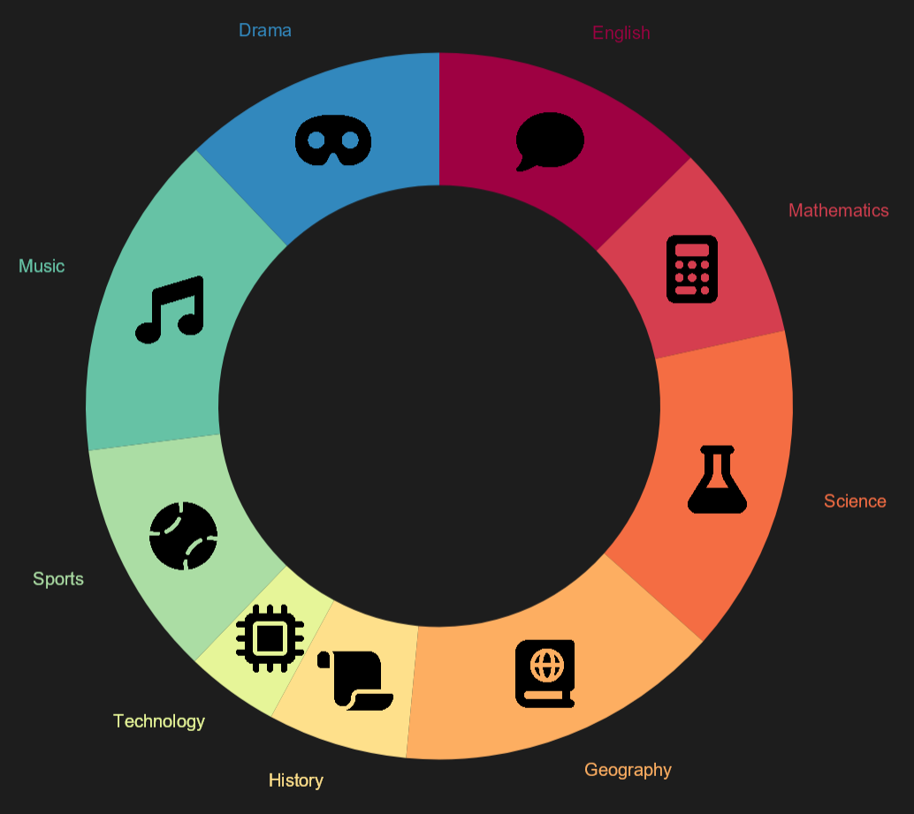

# [⮪](README.md) Setting Entry Images
Once you've [setup](../../README.md#-setting-up) your [`DonutChartView`](../Reference/DonutChartView.md) there's a property called [`EntryImageTemplate`](../Reference/DonutChartView.md) that you can populate to render icons for each entry. This property expects a [`DataTemplate`](https://learn.microsoft.com/en-us/dotnet/api/microsoft.maui.controls.datatemplate?view=net-maui-8.0) that creates a [`FileImageSource`](https://learn.microsoft.com/en-us/dotnet/api/microsoft.maui.controls.fileimagesource?view=net-maui-8.0). 

## Static Image
So if your MAUI project had an image file called `baseball.png`, to render every entry with that image you'd populate the property as follows:

### XAML
```xaml
<donut:DonutChartView.EntryImageTemplate>
    <DataTemplate>
        <FileImageSource File="baseball.png" />
    </DataTemplate>
</donut:DonutChartView.EntryImageTemplate>
```

### Code-Behind
```C#
static object LoadEntryIcon()
{
    return ImageSource.FromFile("baseball.png");
}

MyChartView.EntryImageTemplate = new DataTemplate(LoadEntryIcon);
```

Which might look something like this:


> [!NOTE]
> If your images are rendering too large or too small, set the [`EntryImageScale`](../Reference/DonutChartView.md) on your [`DonutChartView`](../Reference/DonutChartView.md) accordingly.

## Dynamic Image
In most scenarios you're going to want to set each entry's image depending on a condition. To allow for this the [`EntryImageTemplate`](../Reference/DonutChartView.md) that you set is provided the original entry object as its binding context, meaning you can handle the image selection however you'd like.

Say your [`EntriesSource`](../Reference/DonutChartView.md) entries are of type `TestResult`, you can setup your [`EntryImageTemplate`](../Reference/DonutChartView.md) with the `x:DataType` tag to allow for compiled bindings and then bind the image file on the [`FileImageSource`](https://learn.microsoft.com/en-us/dotnet/api/microsoft.maui.controls.fileimagesource?view=net-maui-8.0).

In the following example, we bind to a property called `Category` on the `TestResult` model which is an [`enum`](https://learn.microsoft.com/en-us/dotnet/csharp/language-reference/builtin-types/enum). Then we use a [binding value converter](https://learn.microsoft.com/en-us/dotnet/maui/fundamentals/data-binding/converters?view=net-maui-8.0) to convert the `TestResult`'s `Category` to the image file we want to display.

### XAML
```xaml
<donut:DonutChartView.EntryImageTemplate>
    <DataTemplate x:DataType="m:TestResult">
        <FileImageSource File="{Binding Category, Converter={StaticResource ResultCategoryImageConverter}}" />
    </DataTemplate>
</donut:DonutChartView.EntryImageTemplate>
```

### Code-Behind
```C#
static object LoadEntryIcon()
{
    FileImageSource imageSource = new();
    imageSource.SetBinding(FileImageSource.FileProperty,
        new Binding(
            path: nameof(TestResult.Category),
            converter: new ResultCategoryImageConverter())
        );
    return imageSource;
}

MyChartView.EntryImageTemplate = new DataTemplate(LoadEntryIcon);
```

Which might look something like this:



> [!NOTE]
> If your images are rendering too large or too small, set the [`EntryImageScale`](../Reference/DonutChartView.md) on your [`DonutChartView`](../Reference/DonutChartView.md) accordingly.